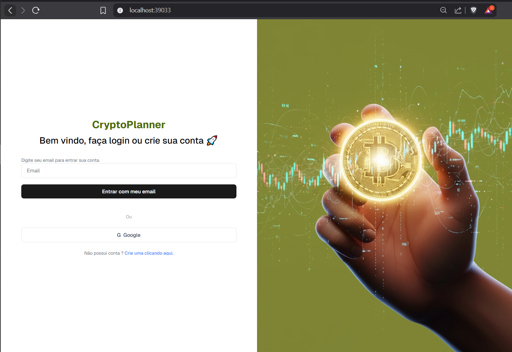

# Cap 9 - Muito estilo sem sofrimento

Este é um projeto desenvolvido para a faculdade FIAP com o objetivo de praticar a construção de uma interface web a partir de um design feito no Figma. O projeto é **estático**, construído apenas com **HTML** e **CSS**, sem qualquer tipo de integração com backend ou JavaScript.

---

## 🖼️ Design de Referência

O layout foi replicado de forma responsiva com base na imagem abaixo, exportada do Figma:


O Resultado:

## 

## 🚀 Tecnologias Utilizadas

- HTML5
- CSS3

---

## 📁 Estrutura do Projeto

```bash
/
├── index.html
├── style.css
└── screen.png  # Imagem do Figma utilizada como referência
└── fiapbg.png  # Imagem de background
└── result.png  # Imagem de resultado
```
